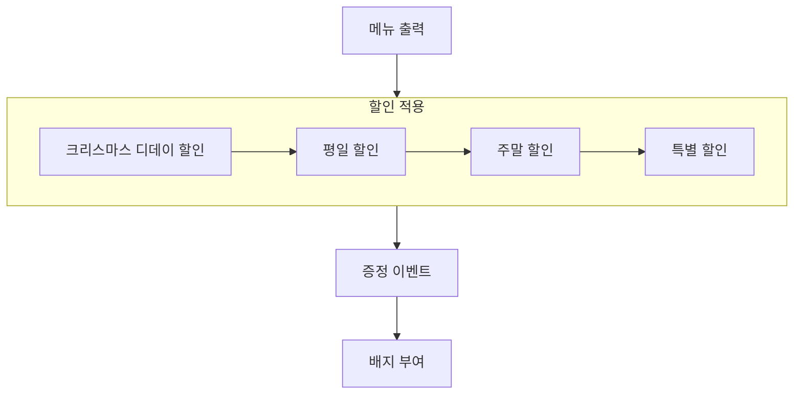

## 순서도

## 기능 구현 목록

- [ ] 메뉴를 출력한다.
  - [ ] 메뉴를 종류별로 구분하여 출력한다.
  - [ ] 제목과 가격을 함께 명시한다
  - [ ] 가격에 ,를 명시하여 알아보기 쉽게 한다.
- [x] 크리스마스 디데이 할인
  - [x] 크리스마스 당일까지만 할인한다.
  - [x] 1000원부터 시작하여 하루에 100원씩 할인 금액이 증가한다.
    - [x] 12월 1일: 1,000원 할인
    - [x] 12월 25일: 3,400원 할인
    - [x] 12월 26일: 0원 할인
- [x] 평일 할인
  - [x] 디저트 메뉴 할인
  - [x] 1개당 2,023원 할인
  - [x] 일, 월, 화, 수, 목
- [ ] 주말 할인
  - [ ] 메인 메뉴 할인
  - [ ] 1개당 2,203원 할인
  - [ ] 금, 토
- [ ] 특별 할인
  - [ ] 이벤트 달력에 별이 있으면 할인
  - [ ] 1,000원 할인
- [ ] 증정 이벤트
  - [ ] 할인 전 총 주문 금액이 120,000원 이상인 경우 할인
  - [ ] 샴페인 1개 증정
- [ ] 이벤트 배지 부여
  - [ ] 총 혜택(할인) 금액에 따라 이벤트 배지 부여
  - [ ] 5,000원 이상: 별 배지
  - [ ] 10,000원 이상: 트리 배지
  - [ ] 20,000원 이상: 산타 배지

- [ ] 예외 처리 필요 사항
  - [ ] 총 주문 금액이 10,000원 이상인 경우만 할인 적용
  - [ ] 음료만 주문 불가
  - [ ] 메뉴는 한 번에 최대 20개까지만 주문 가능
