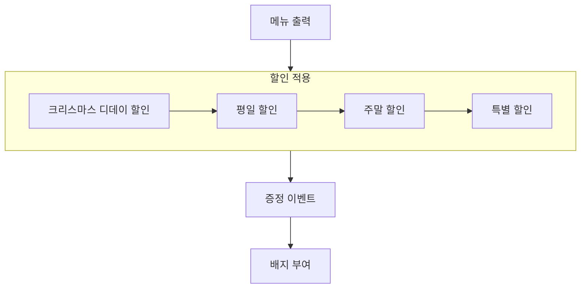

# 우테코 식당 크리스마스 이벤트

## 프로그램 설명

### 개요
우테코 식당에서 크리스마스를 맞아 2023년도 12월 한 달간 크리스마스 기념 이벤트를 개최한다.  
구매하는 품목과 금액에 따라 다양한 할인과 증정품, 그리고 배지까지 나눠준다.

### 메뉴
```
<애피타이저>
양송이수프(6,000), 타파스(5,500), 시저샐러드(8,000)

<메인>
티본스테이크(55,000), 바비큐립(54,000), 해산물파스타(35,000), 크리스마스파스타(25,000)

<디저트>
초코케이크(15,000), 아이스크림(5,000)

<음료>
제로콜라(3,000), 레드와인(60,000), 샴페인(25,000)
```
우테코 식당에서 판매하는 메뉴는 위와 같다.

### 안내사항 (입출력)
- 방문 날짜를 입력받는다.
- 주문할 메뉴와 그 개수를 입력받는다.
- 할인 전 총 주문 금액을 출력한다.
- 증정품을 출력한다.
- 적용되는 할인 내역을 출력한다.
- 할인되는 금액과 증정품 가격을 합산하여 총 혜택 금액을 출력한다.
- 할인 적용 후 지불해야 할 금액을 출력한다.

### 주의사항
- 할인 이벤트는 10,000원 이상 구매해야 적용된다.
- 음료만 주문할 수 없다.
- 한 번에 최대 20개의 메뉴만 주문 가능하다.

## 순서도



## 기능 구현 목록

- [x] 메뉴 출력
  - [x] 메뉴를 종류별로 구분하여 출력
  - [x] 제목과 가격을 함께 명시
  - [x] 가격에 ,를 명시하여 알아보기 쉽게 함
- [x] 크리스마스 디데이 할인
  - [x] 크리스마스 당일까지만 할인
  - [x] 1000원부터 시작하여 하루에 100원씩 할인 금액 증가
    - [x] 12월 1일: 1,000원 할인
    - [x] 12월 25일: 3,400원 할인
    - [x] 12월 26일: 0원 할인
- [x] 평일 할인
  - [x] 디저트 메뉴 할인
  - [x] 1개당 2,023원 할인
  - [x] 일, 월, 화, 수, 목
- [x] 주말 할인
  - [x] 메인 메뉴 할인
  - [x] 1개당 2,023원 할인
  - [x] 금, 토
- [x] 특별 할인
  - [x] 이벤트 달력에 별이 있으면 할인
  - [x] 1,000원 할인
- [x] 증정 이벤트
  - [x] 할인 전 총 주문 금액이 120,000원 이상인 경우 증정
  - [x] 샴페인 1개 증정
- [x] 이벤트 배지 부여
  - [x] 총 혜택(할인) 금액에 따라 이벤트 배지 부여
  - [x] 5,000원 이상: 별 배지
  - [x] 10,000원 이상: 트리 배지
  - [x] 20,000원 이상: 산타 배지

- [x] 예외 처리 필요 사항
  - [x] 총 주문 금액이 10,000원 이상인 경우만 할인 적용
  - [x] 음료만 주문 불가
  - [x] 메뉴는 한 번에 최대 20개까지만 주문 가능
